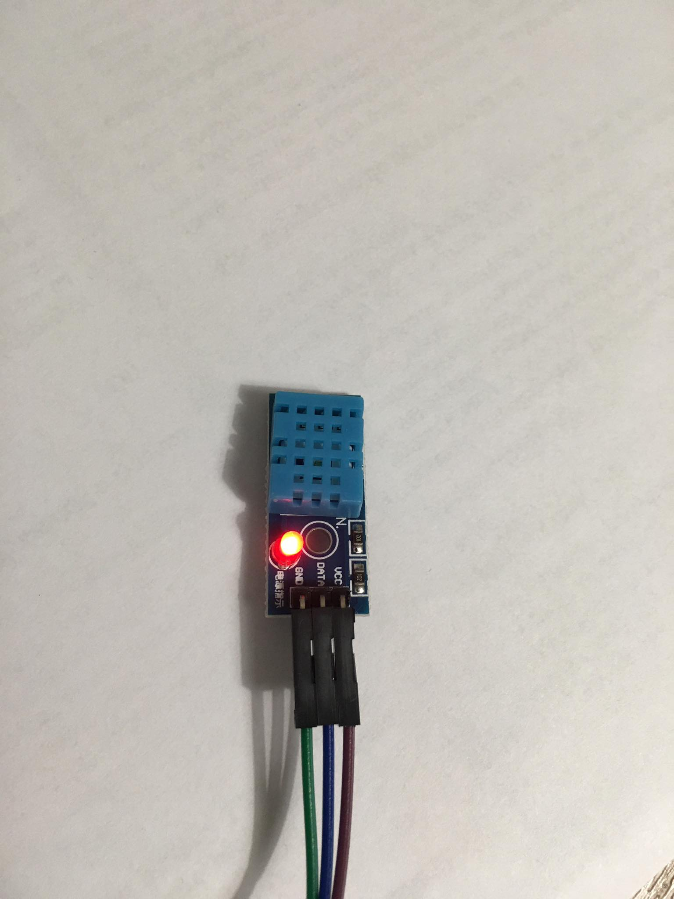
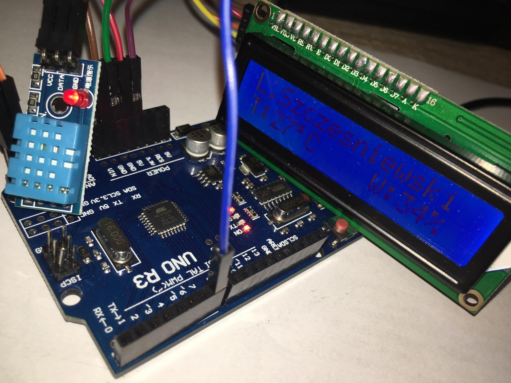
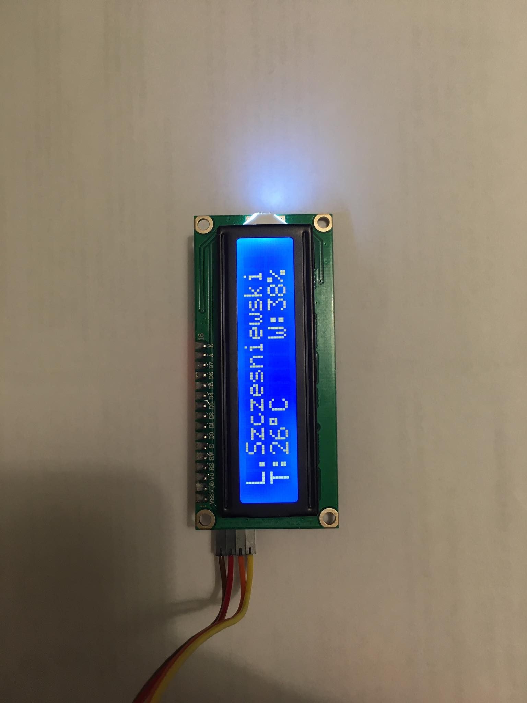
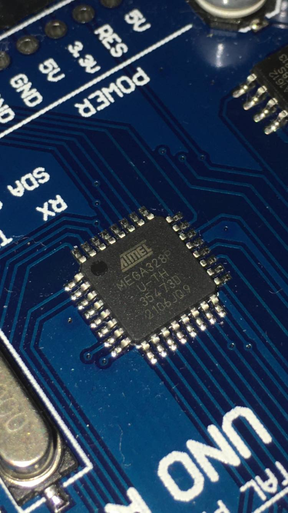

# Projekt z Techniki Mikroprocesorowej

Wykorzystanie minrokontrolera Atmega328 do odczytu temperatury i wilgoci otoczenia

# Założenie projektu
Odczyt temperatury i wilgoci przy użyciu mikrokontrolera AVR ATmega328 

# Do skonstruowania projektu zostały użyte elementy:
- Arduino Uno z mikrokontrolerem Atmega 328
- sensor DHT 11
- wyświetlacz znakowy 2x16 z konwerterem I2C
- przewody połączeniowe

#

